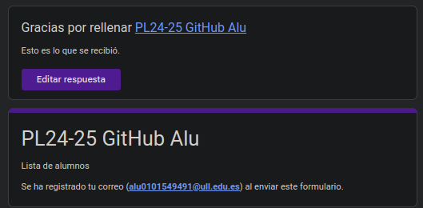
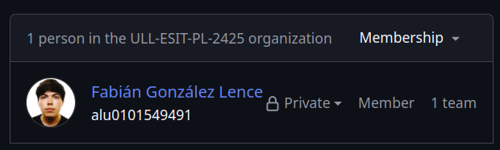
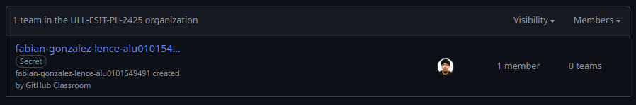
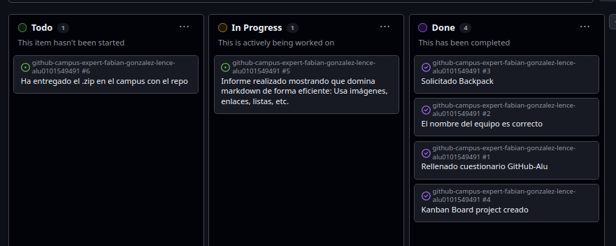
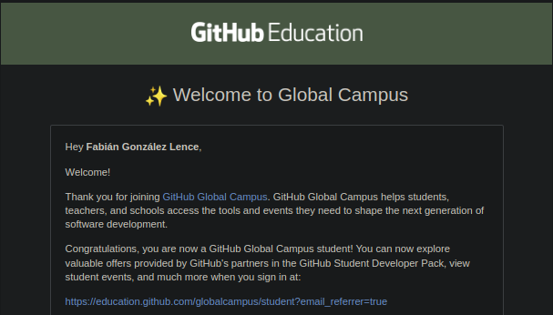

# Github Campus Expert 

- Fabián
- González Lence 
- alu0101549491

## Rellenar el cuestionario GitHub-Alu del campus virtual y recibir el correo confirmándolo

## Pertenecer a la comunidad de ULL-ESIT-PL-2425

## Crear equipo con nombre correcto

## Crear un project board kanban para este repositorio

## Solicitar el GitHub Backpack

